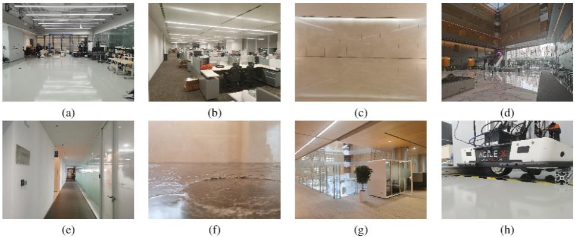
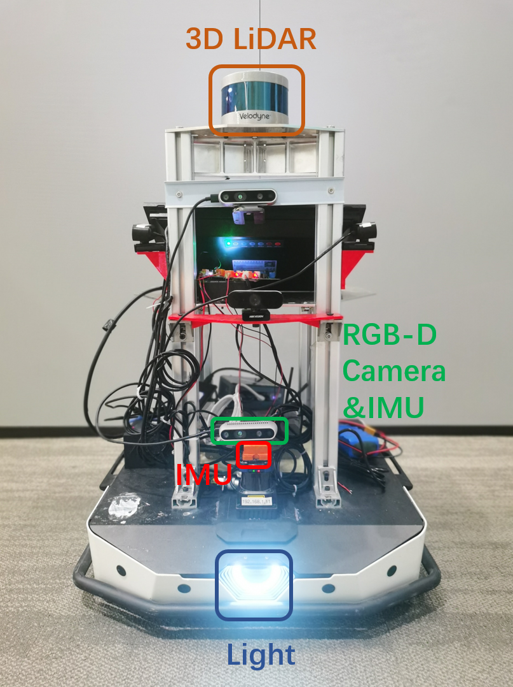

# 	Ground-Challenge
## A Multi-sensor SLAM Dataset	Focusing on Corner Cases for Ground Robots

Figure 1. Different corner cases for SLAM

## Notice: 
###  All the rosbag files have been released now, and the psudo-GT and calibration files in the folder.

 A preprint version of the paper in [Arxiv]([https://arxiv.org/abs/2112.13659](https://arxiv.org/abs/2307.03890)) .If you use M2DGR in an academic work, please cite:
~~~
@article{yin2023ground,
  title={Ground-Challenge: A Multi-sensor SLAM Dataset Focusing on Corner Cases for Ground Robots},
  author={Yin, Jie and Yin, Hao and Liang, Conghui and Zhang, Zhengyou},
  journal={arXiv preprint arXiv:2307.03890},
  year={2023}
}
~~~

## ABSTRACT:

We introduce Ground-Challenge: a novel dataset collected by a ground robot with multiple sensors including an RGB-D camera, an inertial measurement unit (IMU), a wheel odometer and a 3D LiDAR to support the research on corner cases of visual SLAM systems.
Our dataset comprises 36 trajectories with diverse corner cases such as aggressive motion, severe occlusion, changing illumination, few textures, pure rotation, motion blur, wheel suspension, etc. Some state-of-the-art SLAM algorithms are tested on our dataset, showing that these systems are seriously drifting and even failing on specific sequences.
We will release the dataset and relevant materials upon paper publication to benefit the research community.

## MAIN CONTRIBUTIONS:

* We collect a novel visual SLAM dataset for ground robots with a rich pool of sensors in diverse environments both indoors and outdoors. Particularly, the dataset covers a series of challenging sequences for sensor failures and specific movement patterns.
*  State-of-the-art SLAM algorithms of different settings are tested on our benchmark. And the results indicate these systems are not robust enough for situations such as sensor failures.
* To facilitate the research on corner cases of robot navigation, we will release the dataset with ground truth trajectories and the configuration file of each tested algorithm upon paper publication.

## 1.SENSOR SETUP
### 1.1 Acquisition Platform
The ground robot is given below. The unit of the figures is centimeter.

Figure 2. The data capture robot.

### 1.2 Sensor parameters

All the sensors and track devices and their most important parameters are listed as below:

* **LIDAR** Velodyne VLP-16, 360 Horizontal Field of View (FOV),-30 to +10 vertical FOV,10Hz,Max Range 200 m,Range Resolution 3 cm, Horizontal Angular Resolution 0.2°.  

* **V-I Sensor**,Realsense d435i,RGB/Depth 640*480,69H-FOV,42.5V-FOV,15Hz;IMU 6-axix, 200Hz  
* **IMU**,Xsens Mti-300,9-axis,400Hz;  
* **Wheel Odometer**,AgileX,2D,25Hz;  

The rostopics of our rosbag sequences are listed as follows:

* LIDAR: `/velodyne_points` 

* V-I Sensor:  
`/camera/color/image_raw `,  
`/camera/depth/image_raw `,  
`/camera/imu`

* IMU: `/imu/data `
 
* Wheel Odometer: `/odom `

## 2.DATASET SEQUENCES

An overview of Ground-Challenge is given in the table below:
Scenario|Darkroom|Occlusion|Office|Room|Wall|Motionblur|Hall|Loop|Roughroad|Corridor|Rotation|Static|Slope|TOTAL
--|:--|:--:|--:|--:|--:|--:|--:|--:|--:|--:|--:|--:|--:|--:
Number |3|4|3|3|3|3|3|2|3|2|3|2|2|36
Dist/m |92.0|273.8|75.5|102.1|86.7|166.6|236.3|371.8|68.1|164.3|12.4|1.9|128.5|1780.0
Duration/s |203.6|334.2|164.0|154.7|189.3|145.5|302.4|332.7|186.3|198.1|183.2|92.6|195.0|2681.6
Size/GB|6.1|9.9|4.7|4.6|5.6|4.3|8.7|9.9|5.4|5.8|5.4|2.7|5.7|78.8

### 2.1 Visual Challenges

  

  
  
Sequence Name|Total Size|Duration|Features|Rosbag
--|:--|:--:|--:|--:
Darkroom1|2.9g|100s|slight light, going into a room|[Rosbag](https://sjtueducn-my.sharepoint.com/:u:/g/personal/594666_sjtu_edu_cn/EfJ_m0MD1upOphD5vnCoqSoBJ54_5D_vQQD0hpAwAq0qPg?e=nPEMLZ)
Darkroom2|2.3g|76s|sharp turn|[Rosbag](https://sjtueducn-my.sharepoint.com/:u:/g/personal/594666_sjtu_edu_cn/EU4Ns3qCDO5PkjByuoANpf4BRWksqGt_pDnEnKXbbdz9Sw?e=shCbvM)
Darkroom3|1.9g|64s|slight light|[Rosbag](https://sjtueducn-my.sharepoint.com/:u:/g/personal/594666_sjtu_edu_cn/EU2tnWCQitJOiRmNeHaCmtEBG2HssIMag9DRUrJOmYYxUQ?e=H408jO)
Occlusion1|2.9g|97s|moving feet, far features|[Rosbag](https://sjtueducn-my.sharepoint.com/:u:/r/personal/594666_sjtu_edu_cn/Documents/bag/occlusion1.bag?csf=1&web=1&e=ppg9vT)
Occlusion2|3.2g|108s|hand occlusion|[Rosbag](https://sjtueducn-my.sharepoint.com/:u:/r/personal/594666_sjtu_edu_cn/Documents/bag/occlusion2.bag?csf=1&web=1&e=Odo49q)
Occlusion3|2.6g|89s|hand occlusion|[Rosbag](https://sjtueducn-my.sharepoint.com/:u:/r/personal/594666_sjtu_edu_cn/Documents/bag/occlusion3.bag?csf=1&web=1&e=qdf41v)
Occlusion4|1.2g|40s|complete occlusion|[Rosbag](https://sjtueducn-my.sharepoint.com/:u:/r/personal/594666_sjtu_edu_cn/Documents/bag/occlusion4.bag?csf=1&web=1&e=Py4vc7)
Office1|1.3g|46s|exposure change|[Rosbag](https://sjtueducn-my.sharepoint.com/:u:/r/personal/594666_sjtu_edu_cn/Documents/bag/office1.bag?csf=1&web=1&e=l72HgN)
Office2|1.9g|66s|going into a dark room|[Rosbag](https://sjtueducn-my.sharepoint.com/:u:/r/personal/594666_sjtu_edu_cn/Documents/bag/office2.bag?csf=1&web=1&e=iAsgcs)
Office3|1.5g|52s|office|[Rosbag](https://sjtueducn-my.sharepoint.com/:u:/r/personal/594666_sjtu_edu_cn/Documents/bag/office3.bag?csf=1&web=1&e=saJ3ql)
Room1|1.3g|46s|exposure change|[Rosbag](https://sjtueducn-my.sharepoint.com/:u:/r/personal/594666_sjtu_edu_cn/Documents/bag/room1.bag?csf=1&web=1&e=uCWI2N)
Room2|1.9g|66s|going into a dark room|[Rosbag](https://sjtueducn-my.sharepoint.com/:u:/r/personal/594666_sjtu_edu_cn/Documents/bag/room2.bag?csf=1&web=1&e=8JC1bx)
Room3|1.5g|52s|office|[Rosbag](https://sjtueducn-my.sharepoint.com/:u:/r/personal/594666_sjtu_edu_cn/Documents/bag/room3.bag?csf=1&web=1&e=zMDVw9)
Motionblur1|1.5g|52s|aggressive motion|[Rosbag](https://sjtueducn-my.sharepoint.com/:u:/g/personal/594666_sjtu_edu_cn/EVGUofZ_fd1IugqiyFQcV94BVL5qTyNA7HTOkZJNDKTiVw?e=3OcwyD)
Motionblur2|1.6g|54s|aggressive motion|[Rosbag](https://sjtueducn-my.sharepoint.com/:u:/g/personal/594666_sjtu_edu_cn/EeplJdHLC9tMkbN3rXqvc0oBuw5CaRlR7EuxYEBrNnJ9ig?e=mvf14G)
Motionblur3|1.2g|40s|aggressive motion|[Rosbag](https://sjtueducn-my.sharepoint.com/:u:/g/personal/594666_sjtu_edu_cn/EWMqyAlMP8hHmHTab36MkLIB3C_0X6N0n7ARrdSoPBvm1g?e=WERPr6)
Wall1|1.7g|59s|wall in a corridor|[Rosbag](https://sjtueducn-my.sharepoint.com/:u:/g/personal/594666_sjtu_edu_cn/EU15i59tJHxHgBmWZZwvMMkBaNVA37ulgy_Hrk8mP7jyOg?e=lrVK4c)
Wall2|2.0g|66s|wall in a big hall|[Rosbag](https://sjtueducn-my.sharepoint.com/:u:/g/personal/594666_sjtu_edu_cn/EcHTwIhL6Q9Ao9UEtYknrLgBRxK_AyToEPwyfZNrt2PDMg?e=AzPYe4)
Wall3|3.9g|65s|wall in a corridor|[Rosbag](https://sjtueducn-my.sharepoint.com/:u:/g/personal/594666_sjtu_edu_cn/ERaf7TV8R2hBljLdGOIRnRQBGwba8YPYoaJrp4WvytByog?e=CuMjgg)
  

  
### 2.2 Wheel Challenge

   

Sequence Name|Total Size|Duration|Features|Rosbag
--|:--|:--:|--:|--:
Hall1|2.6g|91s|slippery ground, a reflective surface|[Rosbag](https://sjtueducn-my.sharepoint.com/:u:/g/personal/594666_sjtu_edu_cn/EbRe8o9pakFCvmjSKEgOEc0BglOJgScs0IbHFcxr84Fxig?e=SrKLRR)
Hall2|3.2g|110s|slippery ground, a reflective surface|[Rosbag](https://sjtueducn-my.sharepoint.com/:u:/g/personal/594666_sjtu_edu_cn/EYSOrLJ0yRdLrUwH2HIej0kB53Lnwf7TuouMDO-TY-Pkrw?e=olQa4k)
Hall3|2.9g|101s|slippery ground, walking human|[Rosbag](https://sjtueducn-my.sharepoint.com/:u:/g/personal/594666_sjtu_edu_cn/ES5vEb2oe1hAqMVQY3LfgqMBXPlNazdu9B__0R0j3cwyhg?e=SHTCkb)
Loop1|4.1g|97s|moving feet, far features|[Rosbag](https://sjtueducn-my.sharepoint.com/:u:/g/personal/594666_sjtu_edu_cn/EU9mhOpXfEJBm-M0cwbhTwsBL_WvjwkO-GcTzPnmwa-OkQ?e=tKxEvi)
Loop2|5.8g|137s|hand occlusion|[Rosbag](https://sjtueducn-my.sharepoint.com/:u:/g/personal/594666_sjtu_edu_cn/ER_ZcyUZN3dNiwkxT-NeqEoBbphpoCbLnsf5ARp52ARdjA?e=tGObxo)
Roughroad1|2.2g|75s|rough road|[Rosbag](https://sjtueducn-my.sharepoint.com/:u:/g/personal/594666_sjtu_edu_cn/EX-Yic1OhN1GjrcGoaE2mu0BTua8w3C8PvRzMa0rsm84pQ?e=WbUFXR)
Roughroad2|1.5g|52s|rough road|[Rosbag](https://sjtueducn-my.sharepoint.com/:u:/g/personal/594666_sjtu_edu_cn/EV-gMKCrnbFFmGLU5FV32loB-OMys7O3dZ25InJR0aH-0Q?e=s62dlw)
Roughroad3|1.8g|59s|rough road|[Rosbag](https://sjtueducn-my.sharepoint.com/:u:/g/personal/594666_sjtu_edu_cn/EcJemetJZMBPnJwlXNwCySkBTGhc5QXRlTo0fOEFF0uWfQ?e=soHfZ3)

  

  
### 2.3 Specific Movement Patterns
  

  
Sequence Name|Total Size|Duration|Features|Rosbag
--|:--|:--:|--:|--:
Corridor1|2.9g|100s|zigzag, long corridor|[Rosbag](https://sjtueducn-my.sharepoint.com/:u:/g/personal/594666_sjtu_edu_cn/Ed4KpGMgT2RMgzqt0HU0fw8BOvtgx18YnkdJQVekzwfe8g?e=8DjgCH)
Corridor2|2.9g|98s|straight forward, long corridor|[Rosbag](https://sjtueducn-my.sharepoint.com/:u:/g/personal/594666_sjtu_edu_cn/EcWKsukr7nNLrqKloXY3UAIBERmG59qlTgE139U_h4K4OA?e=MdXou7)
Rotation1|1.6g|53s|moving feet, far features|[Rosbag](https://sjtueducn-my.sharepoint.com/:u:/g/personal/594666_sjtu_edu_cn/EeYXHDYMNYNDoMocs1YBj34B3TvYSQtDqV8JjAel37uL9Q?e=upMCTa)
Rotation2|2.1g|73s|hand occlusion|[Rosbag](https://sjtueducn-my.sharepoint.com/:u:/g/personal/594666_sjtu_edu_cn/ET-YIfqH2n1Fv0mlx2nO3QEBnaNllGlxujQlFZa7vCAHLw?e=hgrxGG)
Rotation3|1.7g|57s|rough road|[Rosbag](https://sjtueducn-my.sharepoint.com/:u:/g/personal/594666_sjtu_edu_cn/EX1DtN9we2lDlhTPkG4NaZsBSyOkPGuqfgJxz2o0WwxjFQ?e=ffNdAM)
Static1|1.6g|56s|rough road|[Rosbag](https://sjtueducn-my.sharepoint.com/:u:/g/personal/594666_sjtu_edu_cn/EbAEddIfZqhFglNNf5urVmcB9lFue_HuhJ1_bxwNnxvCGQ?e=igHMQJ)
Static2|1.1g|37s|rough road|[Rosbag](https://sjtueducn-my.sharepoint.com/:u:/g/personal/594666_sjtu_edu_cn/EUy-egIJ3vVMu0Kpc8Q92AcBES_cbSkmps_X7UumZAEmTg?e=Jvj4rL)
Slope1|2.8g|96s|slope|[Rosbag](https://sjtueducn-my.sharepoint.com/:u:/g/personal/594666_sjtu_edu_cn/ETR6Sbd7PltEvzggPaa0DdoBYtK16RhrnpYtQeXrPcdUug?e=5IwkjC)
Slope2|2.9g|99s|slope|[Rosbag](https://sjtueducn-my.sharepoint.com/:u:/g/personal/594666_sjtu_edu_cn/EQ6TUsSfrBdAiAljY8o2HLEBj62PzAp2g0c4XKcQtvHg0A?e=yvylnu)

## 3. CONFIGURERATION FILES
For convenience of evaluation, we provide configuration files of some well-known SLAM systems as below:

## To be uploaded

## 4. CALIBRATION FILES
## To be uploaded
